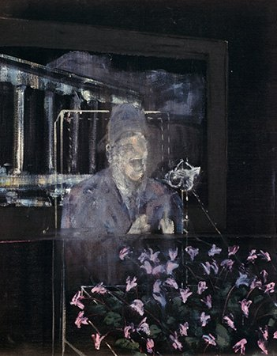
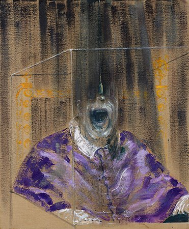
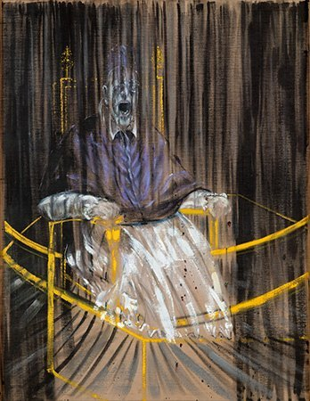
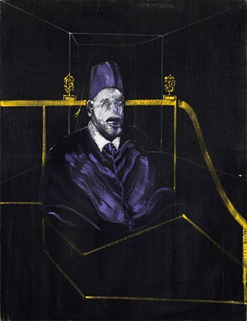
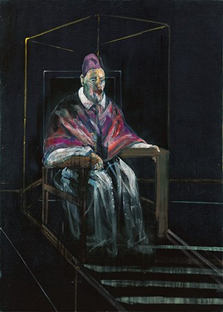
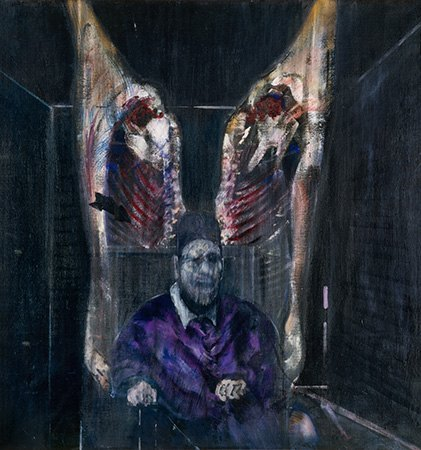
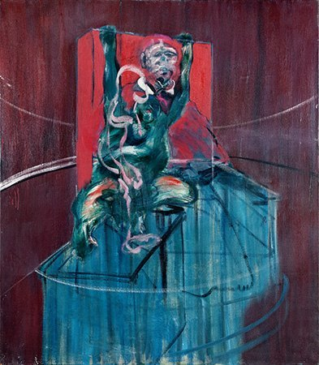
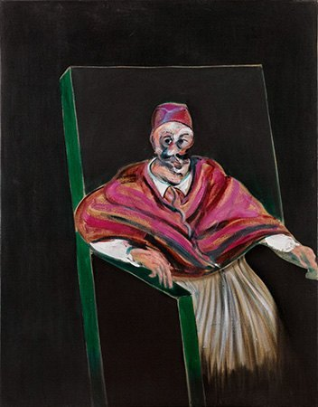
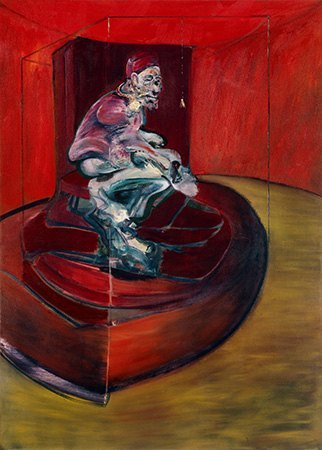
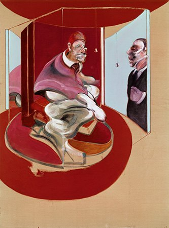

# 教皇还剩下什么？
## 弗朗西斯·培根教皇母题的形成、变奏与回返，约1946—1971

**《培根的教皇·作品图谱》配套研究报告｜研究稿 v1.0｜2026年9月13日**

### 摘要

把培根的教皇画按年代排列，很容易得到一条动人的故事：宗教权威先被尖叫击碎，继而化为普通人的肉身，最后进入画家关于亲密关系与死亡的私人世界。本报告保留这个解释的洞察，却反对把它当成作品实际经历的单向进程。更符合材料的判断是：**教皇并没有逐渐被“人”取代；培根不断重新分配这个形象中身份、身体、图像传统和个人经验的比重。**早期作品已经包含私人身体经验，中期作品不全是尖叫，1961年仍出现集中成组的教皇，而1971年的返回也不是对整个母题的最终解释。

这份报告围绕一个可反复回到画面检验的问题展开：**当一张肖像仍让我们认出身份，却不再保证面孔、声音、身体和空间彼此一致时，我们究竟看见了什么？**论证分为三层：目录与档案能够确认的事实，能够指向具体画面关系的观察，以及仍可被其他解释挑战的判断。文中作品编号使用2016年《作品全集》的CR编号，与现有图谱的作品入口对应。[1](#r1)

> 配合网页阅读：先看CR 49-07、53-02、56-06和71-04，再加入53-12、54-14、60-07、61-08及62-02。不要只用最著名的1953年作品代表全部教皇画。文末提供作品索引和四组比较路线。

## 一、先把问题改写：这是一个怎样的“系列”？

这里的“教皇系列”首先是一个研究上的集合，不是一部由画家事先写好情节、按章节依次完成的视觉小说。它包含明确借用委拉斯开兹的作品，也包含标题只称“头部”“肖像习作”、但借用了教皇衣袍、椅子或姿态的作品。部分形象处在教皇、穿西服的男人和不明身份坐像之间。现有网页的“核心／关联”划分适合浏览，却不应被当作毫无争议的艺术史分类。

甚至标题也不能全部当作画家的原话。官方目录说明，置于引号内的标题可能是后来的描述性命名；同一作品还可能经历名称、年代或“毁弃”状态的修订。因此，本报告保留《“教皇与黑猩猩”》的描述性标题性质，也使用现行目录的“约1960年”，而不是一些旧文献沿用的1962年。这个差异不是可随意抹平的排版问题：它关系到我们如何组织“发展”的故事。[1](#r1)[12](#r12)

研究的第一个限制由此出现：**存世作品的排列，不完全等于创作过程本身的排列。**毁弃、私人保存、迟至多年后才公开的作品，会使某些阶段显得比原本更连贯，某些阶段则像突然中断。我们可以谈目前证据所支持的变化，却不能把图谱的空隙都解释为画家有意识地放弃某种问题。

本报告采用的材料包括官方在线目录、博物馆收藏及研究文章、已公开的访谈引文和档案说明、学者发表于机构或本人网站的文章。没有把只查到书目信息的专著冒称为通读材料；Rina Arya的论文仅取得摘要，德勒兹部分依据出版社的内容说明及书目核实，因而只概括其解释方向，不伪造逐页引文。拍卖行材料用于核实作品、展示与人物说明时有价值，但它关于“预言”“悲剧终章”的措辞，仍须接受批判，而不能自动升级为艺术家的意图。

这一方法也要求修正先前的讨论：1949年的《头部VI》是重要节点，不是毫无前史的绝对起点；“越画越抽象”“越到晚期越私人”“晚期只是平静地接受死亡”，都需要由具体作品逐项检验，而不能当作既定结论。

## 二、为什么是委拉斯开兹：权威不是一个可以轻易剥掉的外壳

委拉斯开兹的《教皇英诺森十世肖像》通常标为约1650年；收藏方多利亚·潘菲利美术馆更具体地提出1649年底至1650年1月的可能年代。原作尺寸为141×119厘米。画中权力并不只由红衣、座椅或教皇身份构成，它也由一个有分量的身体、手的停驻、略有侧转的姿态及难以回避的目光维持。[2](#r2)

因此，把两位画家概括成“委拉斯开兹画权力，培根画脆弱”，并不准确。前者的面孔已经不是无个性的制度徽章。我们可以在同一张脸上感到警觉、疲惫、判断甚至不信任；这些感受未必是人物真实心理的记录，却确实说明画面不能被压缩成“至高权威”的图解。

**本报告的比较判断是：培根并非给一个本来没有肉身的人补上肉身，而是破坏原作把身份、面貌、姿态和绘画空间协调起来的方式。**原作允许这些因素相互加固；培根常让它们彼此拆台。衣袍继续宣布“这是重要的人”，面部却难以维持一个稳定的自我；椅子保留尊位，却未必再能支撑身体；图像仍有识别性，人物却变得难以把握。

这也解释了为什么教皇的特殊身份不能在解释中被过早取消。如果画中只是完全匿名的肉块，张口与变形当然仍可令人不安，但“本应最能掌握言辞、礼仪与身体的人，却无法维持形象”的冲突就弱了。**权力没有简单消失；它留下的可识别外观，是不稳定性得以发生作用的条件。**

培根反复借助复制图而不是原作作画。西尔维斯特记述，他即使在1954年到罗马，也没有去看那幅原作。这里不能只说复制品是原作的次等替身：它也使一张古老肖像变成可重复调动、与别的图像拼接的工作材料。[3](#r3)从本报告的角度看，这个距离至关重要：培根面对的并非坐在眼前的英诺森十世，而是一种已经被印刷、收藏、翻阅和反复观看塑造的“教皇形象”。

所以，我们可以同时保留两条线索：他与古代大师的竞争，以及他在现代复制图像中的工作。只讲“宗教权威遭到亵渎”，会忽略后一条；只讲“绘画形式实验”，又会低估前一条所携带的历史重量。

## 三、约1946—1951：不是突然发明“尖叫”，而是几条线索开始汇合

关于起点，较新的材料使旧的经典叙述需要更新。Richard Calvocoressi讨论了《“有教皇／独裁者的风景”》（约1946，CR 46-05），并引述培根1946年10月19日给Duncan MacDonald的信：他已经在制作取自委拉斯开兹教皇肖像的作品。这至少能确认，《头部VI》之前，教皇母题已经进入工作。[4](#r4)

[在图谱打开《“有教皇／独裁者的风景”》](index.html#work-46-05)

本报告把这幅画当作“后来道路并非唯一道路”的证据。人物仍与环境发生关系，而不只是独自悬置在一个深色室内。我们不必替这幅尚有命名和年代问题的画编造一个完整政治寓言；真正值得比较的是，人物如何从环境中的一个形象，逐渐成为被画面集中展示、隔离和逼近的对象。

《头部VI》（1949，CR 49-07）把这种问题压缩到胸像尺度。画面最有压力的关系，不只是“嘴张开了”，而是嘴和眼睛获得了极不对称的清晰度：口腔成为强烈的身体入口，上半张脸却难以组织成可与观者稳定对视的面孔。衣袍给出身份提示，纤细的框线又使这个身体像被置于一件展示装置之中。它既靠近，又不完全向我们开放。[5](#r5)

[在图谱打开《头部VI》](index.html#work-49-07)

可以把这种状态理解为权威失去自持，也可以理解为身体感觉突破了肖像的礼仪。但需要留下一个差别：**“我认不清这个人”，不等于“这个人已经没有个体性”。**无法稳定辨认，有时反而增加其不可替代的在场感：观者被某个难以说明的身体牵住，而不是顺利把它认作一个类型。

1950年的两幅《据委拉斯开兹而作的习作》（CR 50-04、50-05）进一步提示，变化不只发生在脸上。人物的可见程度、竖向笔触与深处的距离一起被调整。[6](#r6)本报告建议把它们与《头部VI》并置：前者的问题是“面孔如何失稳”，后者则把问题扩展成“一个人如何在空间中显现，又如何被空间撤回”。

此处不能倒推说，培根所有框架、椭圆区域或封闭空间都由教皇画发明。泰特“看不见的房间”研究把相关空间装置追溯到更早的创作。更稳妥的关系是：**教皇母题与培根的空间语言相互发展，而不是前者单向生出了后者。**[7](#r7)

## 四、1953：变奏的真正对象，是“一个形象怎样还能成立”

1953年必须区分两件事：春天完成的、现藏德梅因艺术中心的《据委拉斯开兹〈教皇英诺森十世肖像〉而作的习作》（CR 53-02），以及其后为纽约Durlacher Bros.展览制作的八幅《肖像习作》。Cleveland Museum of Art的研究将后者描述为同年夏季约两周内集中完成的一组。最著名的德梅因作品不是那八幅中的一幅。[8](#r8)

[在图谱打开德梅因作品](index.html#work-53-02)

在CR 53-02中，人物、座椅与周围线条共同构成一种矛盾的稳定性。正面坐姿和大体居中的安排把人固定下来，向下延展的竖向痕迹却使面孔、身体与背景无法完全分开。黄色的椅架和边界不是可随意剥去的装饰；它们帮助观者判断“人坐在哪里”，也让那种位置的不可靠变得可见。[9](#r9)

本报告将这里的压力理解为：**不是一个已经完整的人被关进笼子，而是画面一面搭建“使人可见”的条件，一面破坏这些条件。**线条既提供位置，也制造阻隔；衣袍既构成人体，也可能变成下坠的颜料；张口既像强烈表达，也可能使个体的语言退到单纯的发声。画中没有给出一个可以最终解释这一状态的事件。我们被迫停留在效果之前，不能轻易用“他遭遇了某件事”把它安置好。

这不是说作品没有历史，也不是说人物“其实没有受苦”。它只是说明，画面没有交付一个足以封闭其意义的事件叙述。观者需要区分“看见一种强烈的身体状态”和“已经知道状态的原因”。

接着看八幅《肖像习作》，重复便不再是单纯的执迷。共同的坐姿、服饰提示和空间结构，形成了一个可比较的框架。对这些画，本报告提出一种实验性的读法：某些条件保持相近，面孔的清晰度、口的状态、身体的浓淡和观看距离被改变；变化于是变得可感。但这不是声称培根按科学实验方案作画，而是为观者建立比较方法。

其中《肖像习作VI》（CR 53-12，明尼阿波利斯艺术博物馆）尤其重要。博物馆研究注意到，它使用相对少的颜料，躯干与脸都被处理得极其简约。[8](#r8)与CR 53-02并看，我们就不能再把强烈感受归结为“画得更满、更细、更猛烈”。在本报告的解释中，VI的危险恰恰来自形象似乎不够成为一个完整的人，却仍没有退出我们的辨认。

[在图谱打开《肖像习作VI》](index.html#work-53-12)

这一阶段的关键不是得出“人最终是一团肉”的口号，而是展示：**肖像可以同时维持身份的残余和身体的失稳，并使两者相互放大。**这比“把经典画扭曲了”更能说明重复的必要性。每一次变奏都在重新决定，多少辨认足以让破坏变得有意义，又有多少破坏仍不至于使形象彻底退出观看。

## 五、1956年的沉默：对“尖叫的教皇”的内部反证

西尔维斯特提醒过，张口并不总等于尖叫：它也可能使人联想到呼吸，或动物发出威胁的状态。把全部作品统称为“尖叫的教皇”，会在观看开始之前替不同的嘴、面孔和身体状态安排好同一种情绪。[3](#r3)

加拿大国家美术馆收藏的《肖像习作I》（CR 56-06；该馆称Study for Portrait No.1，标作1956年10月）是一件应该主动放到观看路线中央，而不是作为旁支略过的作品。它的嘴闭合，目光正对观者，姿态也相对静止。收藏方的研究特别以这些特征区分它与通常被想象成尖叫的教皇。[10](#r10)

[在图谱打开1956年《肖像习作I》](index.html#work-56-06)

它使我们改换问题：如果没有张口，没有明显的身体挣扎，紧张为什么仍在？本报告的回答是，观看关系本身发生了变化。在《头部VI》里，观者可以凝视一个难以回望的面孔；在这幅画中，人物的目光重新介入。观者不再只是检查一个被展示的身体，也开始感到自己正在面对一个可能判断、拒绝或不解释自己的人。

这并不等于他恢复了委拉斯开兹式的稳定。我们仍可感到面孔与衣袍、暗处与身体之间的压迫性距离。差别在于，压力不再必须以声音的想象来组织。**沉默不是尖叫之后得到的安宁，也可以是另一种拒绝被理解的强度。**

因此，“教皇越来越失去主体性”也不是足够好的总体解释：某些作品抹弱了目光，另一些却使目光回来。更准确的观察轴，是谁在看、谁能回看，以及画面怎样使两者不对称。

这里还有一个与网页资料直接相关的细节：该馆公布的尺寸是197.7×142.3厘米，官方在线目录写197×141.5厘米；馆方采用1956年10月的日期，目录记录的是该年10月至11月间送达画廊。两者不应被自动合并成同一种“精确日期”或一个无来源说明的数字。配套报告的作用之一，就是让这些差异保持可追溯。[10](#r10)[11](#r11)

## 六、肉与动物：不是把教皇降格，而是让等级与共同肉身同时出现

《与肉在一起的人物》（1954，CR 54-14）提供了另一个检验“权力走向肉身”的入口。肉不是在晚期才进入培根的人体语言。Martin Harrison的作品全集摘录把这幅画与1946年的《绘画》及1962年的十字架题材联系起来；它还指出，John Deakin在1952年已经拍摄过培根上身赤裸、手持两侧肉块的照片。这一构图早于1954年的画。[13](#r13)

[在图谱打开《与肉在一起的人物》](index.html#work-54-14)

这条材料至少推翻了一项过强的说法：不能说直到1971年戴尔进入红教皇，艺术史图像才第一次与培根的个人身体经验相遇。1950年代，画家的身体、摄影的摆拍、肉的形象和教皇式坐像已经存在可核实的交叉。它并不证明画中教皇“就是培根”，却证明私人经验并不是后来才添加的一层内容。

就画面关系而言，本报告认为最值得保留的是两种阅读的竞争。肉可以像一个反讽的华盖，使尊位得到一种不祥的加冕；也可以削弱人物与其他动物身体之间的绝对区隔。在第一种读法中，肉被权力的构图吸收；在第二种读法中，权力被肉的共同性侵入。画面并没有要求我们只保留其中一种。

同样，关于《“教皇与黑猩猩”》（约1960，CR 60-07），最轻易的解释是“最高精神权威其实也是动物”。但这会迅速把动物变成人类自我认识的道具：动物只是用来降低人的尊严，似乎其价值就在于“使人不像人”。[12](#r12)这种读法重复了它声称要揭开的等级。

[在图谱打开《“教皇与黑猩猩”》](index.html#work-60-07)

本报告建议换一个问题：**当教皇与动物都进入被展示、被围定、被观看的画面条件，哪些差别仍被维持，哪些差别开始不可靠？**这使比较落到位置、尺度、姿态和空间安排，而不只落在“人与兽相似”的哲学命题上。

由共同肉身进一步推出“生命完全平等”，证据仍不充分。共享脆弱性并不自动取消现实中的制度权力，更不等于画家提出了一套动物伦理。这个题材的重要性，恰恰在于它让我们同时看到差别和共同性，而不是替我们完成了道德推论。

## 七、1961—1965：不是母题消失，而是它被重新安排

1961年的六幅《教皇习作》是线性进化论最清楚的反证。它们集中出现，并在1962年的泰特回顾展中展示。CR 61-08《教皇习作I》的目录还记录了1961年5月31日的拍摄日期。可见这不是早年习作的简单遗留，而是画家在事业进入回顾与确认阶段时重新工作的题材。[8](#r8)[14](#r14)

[在图谱打开《教皇习作I》](index.html#work-61-08)

对这一阶段，本报告宁可使用“重新分配”而不是“抽象化程度提高”。比较早期画面里人物被竖向痕迹牵连到背景的方式，与后来人体、座椅和周围色域之间的安排，我们可以考察：不稳定性是不是更加集中到某些身体部位，而较大尺度的画面结构反而趋于清楚？这是一条可逐画验证的观察路线，不是适用于所有1960年代作品的统一法则。

这种变化也不宜被写成“教皇把自己的形式语言传给朋友肖像，然后退出”。图像、身体和空间问题可以在多个题材中同时发展。教皇画不是朋友肖像的必经前级，朋友肖像也不是教皇画已经找到的答案。若把两者放在一起，最值得比较的是同一种绘画操作在不同身份上造成的不同效果：扭曲一位熟人的脸与扭曲一位历史上的教皇，不会因为笔触相似就产生完全相同的观看关系。

1965年的《据〈教皇英诺森十世肖像〉而作的习作》（CR 65-03）再次明确返回原型，说明旧大师关系也没有在新的人体语言中彻底消散。[15](#r15)它提醒我们：**“教皇成为培根的一般人体语言”只能说出一半；另一半是，一般人体语言仍然会回到教皇的特殊历史身份，并受到它的牵制。**

由此，变化的单位不应只是“题材占了多少”，还应是题材所承载的工作发生了什么变化。一个母题出现得少了，不等于它意义变轻；一次集中返回，也不必然意味着回归早年的创作立场。

## 八、1971年的红教皇：四种时间相遇，而不是一幅死亡预言

《红教皇习作，1962，第二版本》（CR 71-04）的标题很容易造成误读。“1962”指向被重新处理的较早构图；这幅第二版本实际绘于**1971年4月**。官方目录同时列出1962年的《据英诺森十世而作的习作》（CR 62-02）。首先应把两幅并看，再谈1971年的私人历史。[16](#r16)[17](#r17)

[打开1962年原版本](index.html#work-62-02) · [打开1971年第二版本](index.html#work-71-04)

第二版本右侧镜中人物被文献辨认为George Dyer，戴尔是与培根关系亲密、并多次进入其绘画的人。作品因而可以在一张画布上调动历史图像、画家自己的旧作和亲密之人的形象。这里真正值得细读的，并非简单的“教皇旁边多了一个人”，而是这个人以怎样的方式出现：他进入的是反射装置，而非与教皇毫无阻隔地共享同一种在场。[18](#r18)

本报告由此提出四重时间的读法。第一重是委拉斯开兹肖像携带的艺术史过去；第二重是培根1962年已画过的构图；第三重是1971年重新作画时的当下，包括戴尔的形象；第四重则属于我们——知道后来发生了什么的观者。这四重时间相互叠加，却不能被压缩成一个“早已注定的结局”。

必须守住的时间界线是：戴尔在1971年10月去世，而这幅画完成于4月。因此，把它直接称为因戴尔之死而画的悼亡画，时间上不成立；把它称为“预言”，也不是档案能够支持的创作动机。拍卖行宣传曾使用预感、悲剧等叙事，但这更适合成为我们研究作品接受史的材料，而不是证明培根事先知道某种结局。[16](#r16)[18](#r18)

这并不意味着观者必须排除后来的悲伤。得知死亡之后，同一镜像会显出与此前不同的情感重量，这是一种真实的观看经验。需要避免的只是把**观看后来发生的变化**倒填为**作画当时已有的意图**。

“亲密”也不意味着不再有距离。镜子中的熟人可能比一位历史教皇更重要，却未必更可以被保存、更可以被完全把握。这使1971年的作品具有一种不同于“宣布众生终有一死”的问题：**当画家把与自己有关的人置入旧有图像，这是否真的使他更能接近这个人，还是只让无法接近变得更加具体？**

因此，我不会把这幅画称为整个系列的答案，更不会把它概括成终于达成的平静。较稳妥的结论是：旧母题在1971年被重新激活，使艺术史记忆、自我重复与亲密关系占据同一画面。死亡改变了后来的理解，却不替我们取消这幅画原本仍然开放的关系。

## 九、图像从哪里来：需要区分“直接来源”“研究框架”和“有意义的比较”

“受谁影响”常被写成一串伟大名字，结果反而模糊了实际关系。培根的作品要求更细的区分：有些来源有信件、访谈或工作室实物支持；有些是批评家用来解释他的方法；有些只是我们认为值得并置的作品。三者都可能有价值，但证据地位不同。

**委拉斯开兹、现代教皇照片与爱森斯坦，属于能够追踪的来源链。**旧肖像提供了座椅、衣袍和尊位等组织方式，现代教皇的新闻照片把宗教人物置入现代公共观看。遗产管理机构也将《战舰波将金号》（1925）中受伤女子的面部形象列为著名1953年作品的重要来源。[3](#r3)[19](#r19)把这些材料放在一起，问题就不再是“宗教人物怎么忽然尖叫”，而是不同年代、不同媒介和不同身份的身体信号怎样在一张画里相接。

这还有一个经常被忽略的层次：著名的男性权威形象，吸收了电影中女性受难形象的某些视觉特征。它不必被解释为一种固定性别寓言，但至少说明教皇不是封闭、自足的身份。他的“表现”已经由别的身体和别的图像参与组成。

**普桑提供的是另一种关于叫喊与观看的历史。**尚蒂伊收藏的《屠杀无辜者》约作于1628—1629年，少量人物被组织成紧迫的暴力场面。关于培根对它的重视，可以参照“普桑、毕加索与培根”展览相关研究，而不应凭两张张口的脸就宣布直接借用了某个细节。[20](#r20)[21](#r21)本报告的比较是：在普桑那里，叫喊有明确的行动情境；培根把某种身体强度带到另一种空间后，原有事件的解释性支撑被减弱，甚至不再交付给观者。力量仍在，因果故事却未必仍在。

**蒙克应首先作为比较对象，而不是未经证明的直接来源。**蒙克美术馆指出，《呐喊》关联着艺术家关于“大自然中的呐喊”的文字，不能只理解成画中人张口发声。[22](#r22)把蒙克与培根并看，可以比较强度如何遍布风景或集中在人体及室内空间，不能因为两者都成为现代不安的图像，就说培根的教皇由蒙克直接发展而来。2001年“呐喊的回声”展览确实把培根作品放入相关比较，但这证明的是策展关系，不是创作来源。[23](#r23)

**伦勃朗与旧大师传统，可以帮助讨论“颜料怎样成为肉身”，但不应制造一张没有文献的谱系图。**Hugh Lane以工作室材料为基础的展览确认培根持续关注包括伦勃朗、委拉斯开兹、梵高和毕加索在内的艺术家；这说明他不是通过抛弃绘画传统而获得现代性。不过，将某一次擦抹具体归给伦勃朗，仍需要更直接的比较与证据。[24](#r24)

**迈布里奇则把我们带回工作材料。**一张来自《运动中的人体》的女子行动图版，在培根工作室中被折叠、沾染颜料，并与1965年的十字架画发生可追踪的关系。[25](#r25)它说明图像来源不只是“看过的东西”，也是能被手操作、损坏、拼接的物件。但这张实物并不证明所有教皇的坐姿或变形都来自迈布里奇。它首先帮助我们理解培根更广泛的工作方法。

这些关系加在一起，支持一种比“孤独天才直接把内心画出来”更复杂的认识：**培根的直接感，常常通过高度间接的材料得到。**印刷复制、电影画面、记忆、摆拍和颜料的偶然痕迹，并非感受的对立面，反而可能是感受获得形状的条件。

## 十、怎样读权力、宗教与暴力：三条解释路线及各自的限度

### 1. 从宗教权威到现代孤独：有力，但容易把作品变成时代插图

1999年“1953年的教皇肖像”展览所收录的释文，以从教座的权威走向私密、封闭观看的转换来组织作品，强调失去稳定信仰后的现代处境。这是一条有影响力、也与画面冲突相呼应的解释。[26](#r26)

它的优点是不会把衣袍、座椅与宗教身份都降为中性的形式。教皇之所以值得保留，恰恰因为这个身份带着超过个人身体的制度与象征分量。但它的危险是太快找到答案：战争、世俗化、存在主义或核时代一旦成为总标题，每一张扭曲的脸就容易被当成同一个“现代人危机”的例证，作品之间的差别反而失去意义。

本报告承认战后历史是重要语境，但不把具体作品自动对应某项战争记忆、核武恐惧或某一哲学命题。**语境说明一种解释为何可能，不等于证明画家为什么画了某个细节。**若要把某张照片与特定政治事件连起来，需要来源鉴定；若要说培根有意谴责某一教皇的政治行为，也需要比“看起来令人不安”更强的材料。

宗教问题同样不能被“画家不信神”终结。Rina Arya的论文摘要提出，理解作品中的无神论仍须正视其与基督教图像传统的关系。本报告仅据摘要引入这一问题，而不将其完整论证据为己有。[27](#r27)对我们而言，关键是：图像可以不宣扬宗教，却仍依靠宗教形象的重量产生力量；它甚至可能一面拆解权威，一面借用权威的庄严与舞台。

### 2. 从意义转向感觉：解释颜料如何工作，但不能取消历史差别

德勒兹《弗朗西斯·培根：感觉的逻辑》的问题，不是给每一幅画寻找一个隐藏故事，而是研究隔离的人物、变形的肉、色彩和偶然操作如何使绘画产生感觉。这里“感觉”不是简单的个人情绪，而是观者面对一张画时，身体被颜色、边界、节奏和形体关系直接调动的经验。本报告依据经核实的出版说明概括这一方向，不把未经取得的全书段落当作已逐页查验的证据。[28](#r28)

这一方向能帮助我们区别“画里有人遭到暴力”与“画面的组织本身产生强度”。不需要先确定某个施暴者是谁，观者也可能感到束缚、逼近、下坠或扭转。它使颜料不再只是把心理内容搬到画布上的透明工具。

但如果从这里进一步说身份不重要、历史不重要，便失去了教皇母题最有力的矛盾。同一套笔触施加于熟人、陌生人、动物与教皇，并不必然得到同一种效果。**形式怎样作用，与它作用在什么形象上，应一起讨论。**本报告因此把感觉分析与图像来源相连，而不是让前者取代后者。

### 3. 从隐秘心理回到观看关系：解释可以深入，却不能不可证伪

精神分析取向容易被简化成“教皇等于父亲，扭曲等于创伤”。Darian Leader的《Bacon and the Body》则把问题转到身体与其镜像、表面和无法被完整收纳的经验之间。他也提醒读者，艺术家的言说、否认与自我塑造本身需要被研究。[29](#r29)

这个方向对1971年的镜像尤其有启发：一幅画能否把一个人“收入”其中？身体的反射是否就是身体本身？但这些是帮助我们观察的理论问题，不是用来给培根作心理诊断的工具。理论越能解释任何结果，越需要主动说明什么样的证据会使它失效。

本报告的取舍是：宗教—历史路线保留身份的重量，感觉路线解释画面怎样工作，档案和观看关系则阻止两者变成无须验证的总论。三条线不必合并成唯一真理；它们的摩擦，恰好让图像继续开放。

## 十一、一个更困难的问题：形象的不可把握，是否就是尊重他者？

从这些作品出发，很容易走向“他者性”：脸被破坏，人物变得不可完全解释，所以画家尊重了人的不可穷尽。但这中间少了一步。**不可辨认是一种图像效果；尊重是一个伦理判断，两者并不自动相等。**一个身体可以被画得神秘，也可以只是被用来制造强烈刺激。

本报告因而把“他者”保留为问题，而不是赞美培根的结论。观者究竟是在与一个不愿被理解的人相遇，还是在安全距离外消费一幅痛苦的奇观？当教皇不能回看时，我们是否更容易支配他的形象？当1956年的目光重新看过来，这种支配是否受到阻碍？当动物与人被并置，动物是否拥有自己的位置，还是只是用来解释人？

这些问题不需要先认定培根善意或恶意。它们要求我们把观看者也纳入画面关系。画中似乎被围困的人，不是这个关系里唯一的身体；我们的目光、判断和观看快感，同样参与其中。

这里还必须区分画中玻璃式框架、作品现实中的保护玻璃，以及手机屏幕这三种不同界面。加拿大国家美术馆披露的1957年往来信件说明，培根希望那幅作品在玻璃后展示，并提及保存及视觉深度；这不能自动证明所有观者反射都是他预设的心理装置。[10](#r10)但它确实提醒我们，今天在网页上看到的图像不是无中介的原作。

数字图谱可以让原本分散的作品同时出现，这是它最重要的研究能力；它也会把两米高的画与九十厘米高的画压成同样大的图片，把玻璃、尺度、表面与现场距离拿走。清晰的图片能改进某些观察，却不能补回所有这些条件。我们越重视网页，就越应该说明它使哪些比较成为可能，又让哪些经验暂时缺席。

## 十二、结论：真正变化的不是“教皇越来越不像教皇”

回到最初的问题，本报告对先前解释作出四项修订。

**第一，起点是汇合，不是凭空突破。**1940年代的身体、动物、空间和复制图像，已经交叉发展；1949年的意义在于一次特别有力的汇合。**第二，1953年的重复是差别的生产，不只是尖叫的累积。**同一题材帮助我们看见，身份、身体与空间可以如何重新组合。**第三，中期与晚期没有形成整齐的替代关系。**1956年的沉默、1961年的成组回返、1965年的旧大师题名，持续打断“权力消失、普通人出现”的故事。**第四，1971年的私人性并不是此前一切的最终答案。**它重新激活旧问题，并在后来接受史中获得额外的悲伤，却不能被倒读成死亡预言。

因此，最能概括变化的不是“权力的身体终于变成普通的身体”，而是：

> **培根始终让教皇既是一个被我们认出的身份，又是一个无法被这个身份完全安置的身体。不同阶段改变的，是两者如何冲突，以及绘画怎样使这种冲突持续可见。**

这也说明教皇为什么不必彻底退出。若身份完全失效，冲突便只剩匿名肉身；若身体完全服从身份，画面又退回稳定的徽像。培根反复工作的区域，正在这两种完成之间。

从网页继续研究时，可以把原先那句“什么时候开始，这不再是关于教皇的画？”改成更不预设答案的问法：**在这幅画里，教皇身份还在做什么工作？它与身体、空间、复制图像和我们的目光形成了怎样的关系？**每一幅作品都可能给出不同的回答。

## 附录A｜与图谱对应的关键作品索引

下表不是“全部教皇作品”清单，而是本报告的证据骨架。收藏信息指所引用公开记录，不保证当前展出；“私人收藏”不意味着地址已知。作品尺寸与完整资料请从CR入口回到图谱及机构原条目。

| CR／图谱入口 | 作品与年代 | 公开记录中的收藏 | 本报告中的作用 |
|---|---|---|---|
| [46-05](index.html#work-46-05) | 《“有教皇／独裁者的风景”》，约1946 | 私人收藏 | 把起点推到1949年前，保留另一种空间道路。[4](#r4) |
| [49-07](index.html#work-49-07) | 《头部VI》，1949 | Arts Council Collection，伦敦 | 嘴、眼睛、身份与展示框架的不对称。[5](#r5) |
| [50-04](index.html#work-50-04)／[50-05](index.html#work-50-05) | 两幅据委拉斯开兹而作的习作，1950 | Cohen收藏／私人收藏，依目录所载 | 将人物失稳扩展为空间中的显现与退隐。[6](#r6) |
| [53-02](index.html#work-53-02) | 据委拉斯开兹教皇肖像的习作，1953 | 德梅因艺术中心 | 不是八幅《肖像习作》之一；定位与瓦解同时工作。[8](#r8)[9](#r9) |
| [53-12](index.html#work-53-12) | 《肖像习作VI》，1953 | Minneapolis Institute of Art | 以稀少颜料和形象残余产生强度。[8](#r8) |
| [54-14](index.html#work-54-14) | 《与肉在一起的人物》，1954 | 芝加哥艺术博物馆 | 肉身、等级及1952年Deakin照片的前史。[13](#r13) |
| [56-06](index.html#work-56-06) | 《肖像习作I》，1956 | 加拿大国家美术馆 | 闭口与回望；目录与馆方尺寸存在差异。[10](#r10)[11](#r11) |
| [60-07](index.html#work-60-07) | 《“教皇与黑猩猩”》，约1960 | 私人收藏 | 描述性标题；人与动物比较不能直接推出伦理结论。[12](#r12) |
| [61-08](index.html#work-61-08) | 《教皇习作I》，1961 | 私人收藏 | 六幅新作中的一幅，反驳单向退出的说法。[14](#r14) |
| [62-02](index.html#work-62-02) | 《据英诺森十世而作的习作》，1962 | 私人收藏 | 1971年第二版本所返回的既有构图。[17](#r17) |
| [65-03](index.html#work-65-03) | 《据〈教皇英诺森十世肖像〉而作的习作》，1965 | 私人收藏 | 旧大师关系并未被一般人体语言吞没。[15](#r15) |
| [71-04](index.html#work-71-04) | 《红教皇习作，1962，第二版本》，1971年4月 | 私人收藏 | 历史图像、自我重复、戴尔及后来接受史相遇。[16](#r16)[18](#r18) |

## 附录B｜四组比较路线与证据边界

**路线一：谁在看谁？**并看49-07与56-06。先不谈心理，记录嘴是否张开、眼睛能否辨认、目光能否回到观者，再讨论“被展示”与“相遇”的差别。不能从闭口直接推出安宁，也不能从模糊直接推出丧失主体性。

**路线二：颜料越少，强度是否越低？**并看53-02与53-12。比较躯干、手臂、面孔与衣袍的完成程度，以及空处如何参与组织。把“画得稀薄”和“人物显得虚弱”先分开，之后再说明二者为什么可能相接。

**路线三：共同肉身有没有取消等级？**并看54-14与60-07。观察人物和动物／肉的尺度、位置与边界。先问画面保留了什么差别，再问共同性怎样出现，不以“人也是动物”提前替作品作结。

**路线四：返回旧作究竟改变了什么？**并看62-02与71-04，再回看53-02。区分构图变化、人物进入方式和我们的后见之明。1971年4月与10月必须作为两个不同时间保存。

配套网页中的比较区按这些路线排列作品，不把像素高度当作实际画布尺度。原图按钮、CR链接和来源可分别用于核对图像与记录。正文中的观察是本报告的解释，不冒充目录原文；新增热点坐标也不应被误当作艺术史证据，它们只是帮助读者找到所讨论的区域。

### 图像与资料说明

本研究页复用现有图谱中的参考图文件，不以本报告的加入宣称此前高分辨率升级已全部上传或公开部署。图像不足以支持笔触材质、颜料厚度或色彩校准的精确判断时，正文只讨论较大尺度的图像关系。DACS确有部分作品的更高规格授权图像；公开网页上的较大文件不等于全球最高分辨率，也不等于不受版权限制。[30](#r30)

图像版权归The Estate of Francis Bacon／DACS及相应摄影、收藏机构。文中图片用于伴随批评和研究识别作品；不标记为公有领域，不通过生成式放大创造原画没有的细节。本报告没有进行原作现场检查，也不声称已逐页阅读2016年五卷本全集。网页中画布尺寸、现场玻璃和收藏状态的问题，都应保留为可继续核查的层面。

## 参考文献与查阅范围

以下链接的资料查阅日期为2026年9月13日。标明“摘要”“出版说明”或“摘录”的材料，仅在相应范围内使用；列为延伸阅读的书目不视作已全文查验。

**[1] 编目规则。**The Estate of Francis Bacon，在线《作品全集》各条目的“Notes for Readers”，据Martin Harrison与Rebecca Daniels，*Francis Bacon: Catalogue Raisonné*（2016），卷1，第102—103页。使用标题、约略年代、摄影日期及毁弃标记等公开规则；未取得全套纸本。示例条目：[Pope and Chimpanzee](https://www.francis-bacon.com/artworks/paintings/pope-and-chimpanzee)。

**[2] 原作记录。**Galleria Doria Pamphilj，[*Portrait of Pope Innocent X Pamphilj*](https://www.doriapamphilj.it/en/portfolio/velazquez/)，FC 289；收藏方作品说明。

**[3] 访谈者的批评论文。**David Sylvester，“The Supreme Pontiff”，收于*Important Paintings from the Estate*（1998）；[遗产管理机构公开转载](https://www.francis-bacon.com/bacons-world/exhibitions/important-paintings-estate-1998)。使用公开全文中关于复制图、张口状态及罗马访问的讨论；其“第一幅教皇”叙述须与后出材料比较。

**[4] 档案与早期作品研究。**Richard Calvocoressi，“[Francis Bacon: The First Pope](https://gagosian.com/quarterly/2022/05/20/essay-francis-bacon-the-first-pope/)”，*Gagosian Quarterly*，Summer 2022。使用其对CR 46-05和1946年信件的研究；信件经该文转引，未直接检查手稿。

**[5] 作品记录。**The Estate of Francis Bacon，[*Head VI*](https://www.francis-bacon.com/artworks/paintings/head-vi)，1949，CR 49-07。

**[6] 作品记录。**The Estate of Francis Bacon，[*Study after Velázquez*](https://www.francis-bacon.com/artworks/paintings/study-after-velazquez)，1950，CR 50-04；[*‘Study after Velázquez’*](https://www.francis-bacon.com/artworks/paintings/study-after-velazquez-0)，1950，CR 50-05。

**[7] 空间研究。**The Estate of Francis Bacon，“[Francis Bacon: Invisible Rooms at Tate Liverpool](https://www.francis-bacon.com/news/francis-bacon-invisible-rooms-tate-liverpool)”；2016年展览的机构说明，不作为完整展览图录的替代。

**[8] 博物馆研究。**Beau Rutland，“[Popes by Numbers](https://www.clevelandart.org/articles/popes-numbers)”，Cleveland Museum of Art，2016年11月2日。用于1953年两组作品的区分、VI的收藏记录及1961年六幅新作。

**[9] 作品记录。**The Estate of Francis Bacon，[*Study after Velázquez’s Portrait of Pope Innocent X*](https://www.francis-bacon.com/artworks/paintings/study-after-velazquezs-portrait-pope-innocent-x)，1953，CR 53-02。

**[10] 收藏史与档案引文。**Sam Phillips，“[Francis Bacon and the Pope Series](https://www.gallery.ca/magazine/your-collection/francis-bacon-and-the-pope-series)”，National Gallery of Canada，2025年9月4日。使用馆藏1956年作品的记录、观看特征及1957年画廊通信；没有将其政治或精神分析推测当作已证实意图。

**[11] 作品记录。**The Estate of Francis Bacon，[*Study for Portrait I*](https://www.francis-bacon.com/artworks/paintings/study-portrait-i-0)，1956，CR 56-06。与[10]的标题写法、尺寸及日期性质并列保存。

**[12] 作品记录。**The Estate of Francis Bacon，[*‘Pope and Chimpanzee’*](https://www.francis-bacon.com/artworks/paintings/pope-and-chimpanzee)，约1960，CR 60-07；含旧文献1962年标年的记录。

**[13] 全集摘录及作品记录。**Martin Harrison，*Francis Bacon: Catalogue Raisonné*（2016），第404页，摘录发表于“[Catalogue Raisonné Focus: Figure with Meat, 1954](https://www.francis-bacon.com/news/catalogue-raisonne-focus-figure-meat-1954)”，2021年6月28日；另见[CR 54-14作品条目](https://www.francis-bacon.com/artworks/paintings/figure-meat)。

**[14] 作品记录。**The Estate of Francis Bacon，[*Study for a Pope I*](https://www.francis-bacon.com/artworks/paintings/study-pope-i)，1961，CR 61-08；含摄影日期与1962年泰特展览记录。

**[15] 作品记录。**The Estate of Francis Bacon，[*Study from Portrait of Pope Innocent X*](https://www.francis-bacon.com/artworks/paintings/study-portrait-pope-innocent-x)，1965，CR 65-03。

**[16] 作品记录。**The Estate of Francis Bacon，[*Study of Red Pope, 1962, Second Version*](https://www.francis-bacon.com/artworks/paintings/study-red-pope-1962-second-version)，1971年4月，CR 71-04。

**[17] 作品记录。**The Estate of Francis Bacon，[*Study from Innocent X*](https://www.francis-bacon.com/artworks/paintings/study-innocent-x)，1962，CR 62-02。

**[18] 1971年作品与接受史。**Christie’s，“[Icons of the spirit and flesh](https://www.christies.com/features/francis-bacon-study-of-red-pope-1962-2nd-version-1971-8527-3.aspx)”，2017年10月5日；使用戴尔镜像说明及时间背景，不接受其预言式营销叙事为创作事实。

**[19] 电影来源。**The Estate of Francis Bacon，“[Iconic Study after Velázquez’s Portrait of Pope Innocent X, 1953 on display](https://www.francis-bacon.com/news/iconic-study-after-velazquezs-portrait-pope-innocent-x-1953-display)”，2018年机构文章。用于爱森斯坦影片来源，不把机构使用的“尖叫教皇”数量口径当作全部教皇画的定数。

**[20] 普桑作品记录。**Château de Chantilly，[*The Massacre of the Innocents*](https://chateaudechantilly.fr/en/categ-collection/paintings/the-massacre-of-the-innocents/)，约1628—1629。

**[21] 展览报道。**“[The Massacre of the Innocents: ‘The greatest scream in the history of painting’. Poussin, Picasso and Bacon](https://www.tretyakovgallerymagazine.com/news/massacre-innocents-greatest-scream-history-painting-poussin-picasso-and-bacon)”，*The Tretyakov Gallery Magazine*，2017。涉及培根评价的内容作为经报道转引，不冒充直接核读原始访谈。

**[22] 蒙克作品阐释。**MUNCH，“[A Scream Through Culture](https://www.munch.no/en/our-collection/a-scream-through-culture/)”及“[The Scream](https://www.munch.no/en/The-Scream/)”；用于作品与“大自然中的呐喊”文本的关系。

**[23] 比较展览记录。**The Estate of Francis Bacon，“[Echoes of The Scream](https://www.francis-bacon.com/bacons-world/exhibitions/echoes-scream-0)”，Munch Museum，2001；用于区分策展比较与直接影响。

**[24] 工作室与旧大师。**Hugh Lane Gallery，“[Francis Bacon and the Art of the Past](https://hughlane.ie/whats_on/francis-bacon-and-the-art-of-the-past/)”，2014—2015年展览，Margarita Cappock策展；使用机构展览说明。

**[25] 工作室实物。**The Estate of Francis Bacon／Hugh Lane，[*Muybridge—Woman Walking*](https://www.francis-bacon.com/artworks/studio/7-reece-mews/muybridge-woman-walking)；实物说明及其与1965年《十字架》的关联。

**[26] 展览中的解释路线。**“Bacon’s Popes: Ex Cathedra to In Camera”，见“[Francis Bacon: The Papal Portraits of 1953](https://www.francis-bacon.com/bacons-world/exhibitions/francis-bacon-papal-portraits-1953)”，Museum of Contemporary Art San Diego，1999年展览网页所载摘文；作为策展阐释而非作者意图的证据。

**[27] 论文摘要。**Rina Arya，“Painting the Pope: An Analysis of Francis Bacon’s Study After Velázquez’s Portrait of Innocent X”，*Literature and Theology* 23(1)，2009，33—50；[DOI:10.1093/litthe/frn039](https://doi.org/10.1093/litthe/frn039)。本次仅查到摘要与书目信息，未据此声称阅读全文。

**[28] 哲学框架与书目。**Gilles Deleuze，*Francis Bacon: The Logic of Sensation*，Daniel W. Smith译，Continuum，2003；法文初版1981。[出版社介绍及目录](https://www.bloomsbury.com/uk/francis-bacon-9781350040823/)／[遗产管理机构书目](https://www.francis-bacon.com/publication/francis-bacon-logic-sensation)。本次使用概括性出版材料，不编造版本页码。

**[29] 研究者原文。**Darian Leader，“[Bacon and the Body](https://www.darianleader.com/art/bacon-and-the-body/)”，作者网站公开全文，网页未标明初刊年份；用于镜像、身体与解释方法，不当作心理诊断或事实定论。

**[30] 图像规格与授权入口。**DACS，[*Figure with Meat, 1954*](https://www.dacs.org.uk/artwork/figure-with-meat-1954-3731)；用于说明公开参考图与授权高规格图像的区别，不据此推断本项目已取得使用许可。

### 延伸阅读：需要取得全文后继续核查

Martin Harrison，*In Camera: Francis Bacon: Photography, Film and the Practice of Painting*（2005），适合继续追查图像来源；Margarita Cappock，*Francis Bacon’s Studio*（2005），适合工作室实物研究；David Sylvester，*The Brutality of Fact: Interviews with Francis Bacon*，适合核对艺术家自述及访谈者的问题如何塑造回答；Michael Peppiatt，*Francis Bacon: Studies for a Portrait—Essays and Interviews*（2008），适合传记与教皇母题的交叉研究。这些专著在本报告中作为后续阅读路线，不冒充本次已逐页核读的资料。
